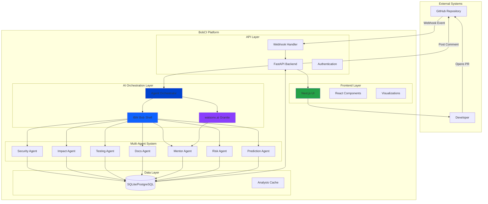
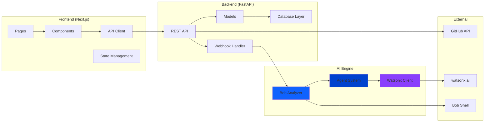
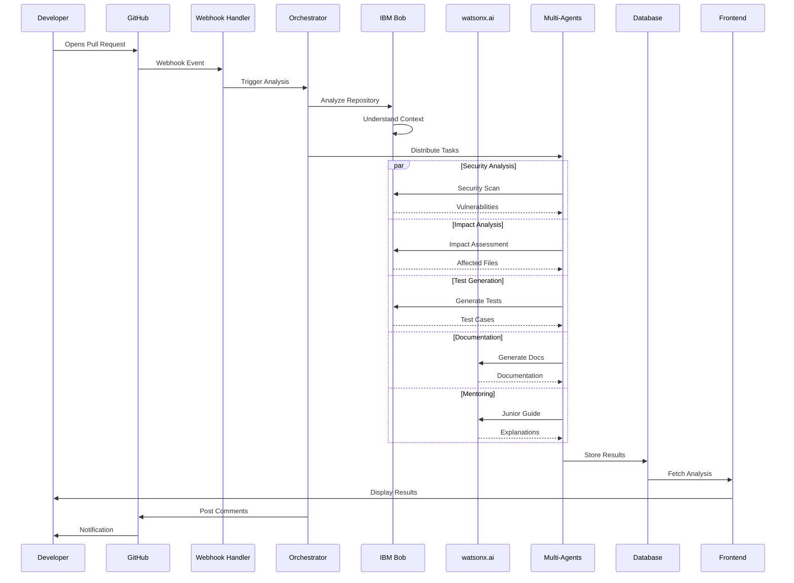
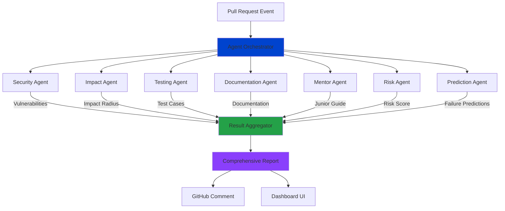
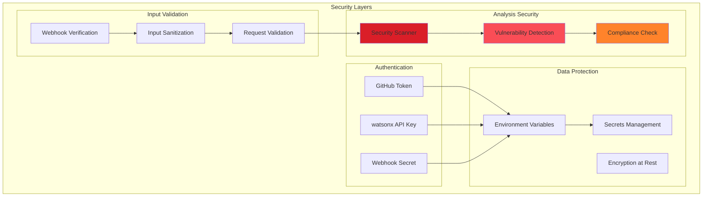
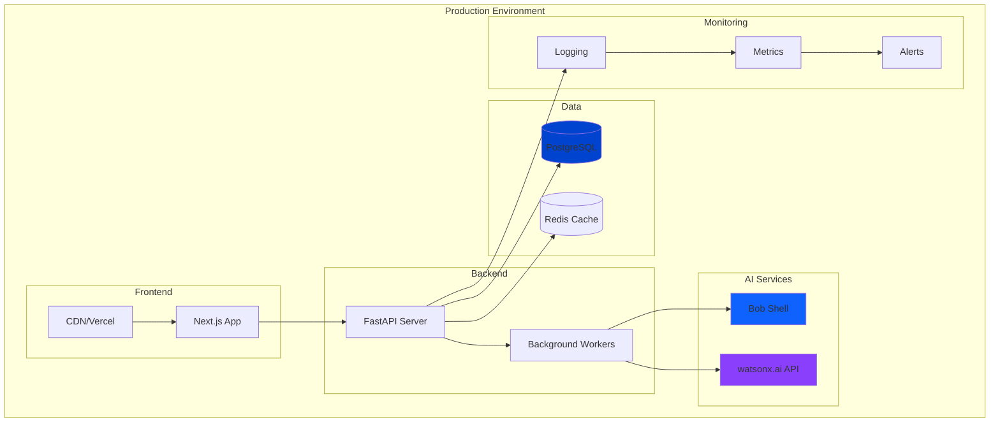

# 🏗️ BobCI System Architecture

## Overview

BobCI is an enterprise-grade AI-powered Pull Request Intelligence System that leverages IBM Bob and watsonx.ai to provide autonomous code review, security scanning, and developer mentoring.

---

## High-Level Architecture

---

## Component Architecture

---

## Data Flow Architecture

---

## Multi-Agent Orchestration

---

## Security Architecture

---

## Deployment Architecture

---

## Technology Stack

### Frontend
- **Framework**: Next.js 14 (React 18)
- **Styling**: Tailwind CSS
- **Animations**: Framer Motion
- **Visualizations**: React Flow, Recharts
- **State**: React Hooks
- **HTTP Client**: Axios

### Backend
- **Framework**: FastAPI (Python 3.9+)
- **ORM**: SQLAlchemy
- **Database**: SQLite (dev), PostgreSQL (prod)
- **Async**: asyncio, BackgroundTasks
- **Validation**: Pydantic

### AI/ML
- **IBM Bob**: Repository intelligence & code analysis
- **watsonx.ai**: Granite 13B Chat v2 model
- **Multi-Agent**: Custom orchestration system

### DevOps
- **Version Control**: Git
- **CI/CD**: GitHub Actions
- **Deployment**: Docker, Kubernetes
- **Monitoring**: Prometheus, Grafana

---

## Scalability Considerations

### Horizontal Scaling
- Stateless API design
- Load balancer ready
- Database connection pooling
- Redis for session management

### Performance Optimization
- Async request handling
- Background task processing
- Response caching
- CDN for static assets

### High Availability
- Multi-region deployment
- Database replication
- Automatic failover
- Health check endpoints

---

## Security Best Practices

1. **Authentication**: Token-based GitHub authentication
2. **Authorization**: Webhook signature verification
3. **Encryption**: HTTPS only, encrypted secrets
4. **Input Validation**: Pydantic models, sanitization
5. **Rate Limiting**: API throttling (planned)
6. **Audit Logging**: All security events logged
7. **Secrets Management**: Environment variables, no hardcoding

---

## Future Enhancements

1. **Kubernetes Deployment**: Container orchestration
2. **GraphQL API**: Flexible data querying
3. **Real-time Updates**: WebSocket support
4. **Advanced Analytics**: ML-powered insights
5. **Custom Models**: Fine-tuned for specific repos
6. **Team Collaboration**: Multi-user support
7. **Integration Hub**: Slack, Teams, Jira

---

*Architecture designed for enterprise-grade scalability and reliability*