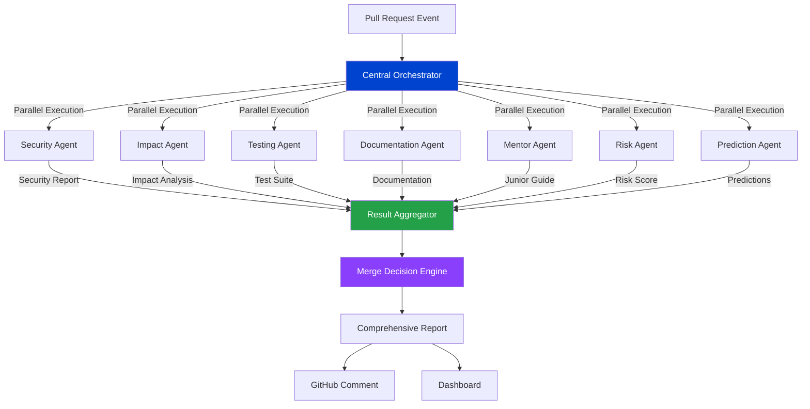
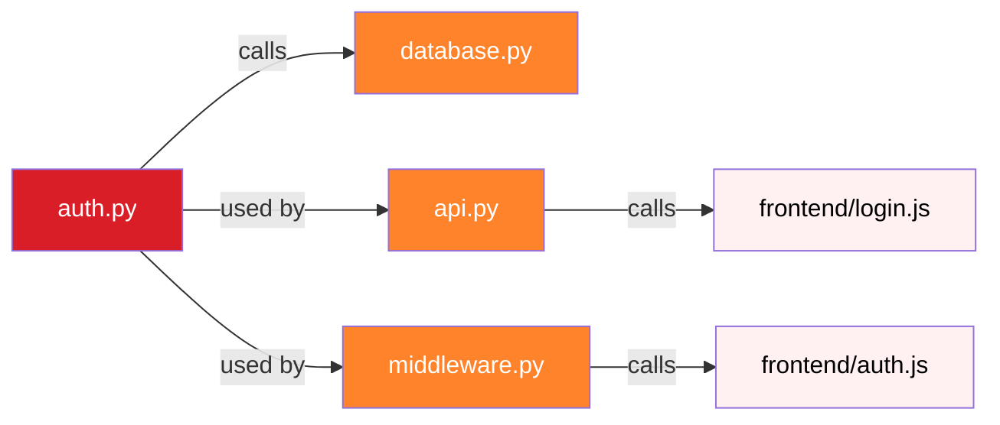
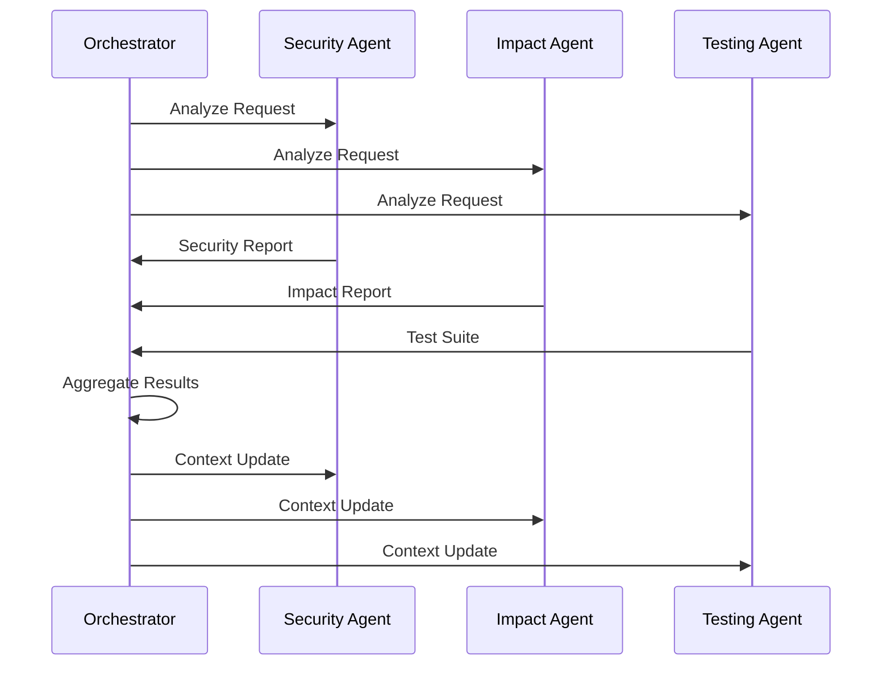

# 🤖 Multi-Agent System Architecture

## Overview

BobCI implements a sophisticated multi-agent AI system where specialized agents collaborate to provide comprehensive pull request analysis. Each agent is an expert in its domain, powered by IBM Bob and watsonx.ai.

---

## 🎯 Agent Orchestration Model



---

## 🔐 Security Agent

### Purpose
Identifies security vulnerabilities, compliance issues, and potential exploits in code changes.

### Capabilities
- SQL injection detection
- XSS vulnerability scanning
- Authentication bypass detection
- Secrets exposure identification
- Dependency vulnerability checking
- OWASP Top 10 compliance

### Analysis Process
```python
class SecurityAgent:
    def analyze(self, diff_content: str) -> SecurityReport:
        vulnerabilities = []
        
        # Pattern-based detection
        vulnerabilities.extend(self._detect_sql_injection(diff_content))
        vulnerabilities.extend(self._detect_xss(diff_content))
        vulnerabilities.extend(self._detect_hardcoded_secrets(diff_content))
        
        # Bob-powered deep analysis
        bob_analysis = self.bob.analyze_security(diff_content)
        vulnerabilities.extend(bob_analysis.vulnerabilities)
        
        # Calculate risk score
        risk_score = self._calculate_risk_score(vulnerabilities)
        
        return SecurityReport(
            vulnerabilities=vulnerabilities,
            risk_score=risk_score,
            recommendation=self._get_recommendation(risk_score)
        )
```

### Output Example
```json
{
  "overall_score": 23,
  "has_critical_issues": true,
  "vulnerabilities": [
    {
      "type": "SQL Injection",
      "severity": "critical",
      "file": "auth.py",
      "line": 3,
      "description": "User input directly concatenated into SQL query",
      "vulnerable_code": "db.query(\"SELECT * FROM users WHERE id=\" + user_id)",
      "fixed_code": "db.query(\"SELECT * FROM users WHERE id=?\", (user_id,))"
    }
  ],
  "recommendation": "block_immediately"
}
```

---

## 📊 Impact Agent

### Purpose
Analyzes the blast radius of code changes and predicts which components will be affected.

### Capabilities
- Dependency graph analysis
- Change propagation tracking
- Breaking change detection
- API contract analysis
- Database migration impact
- Frontend-backend coupling

### Analysis Process
```python
class ImpactAgent:
    def analyze(self, diff_content: str, repo_context: str) -> ImpactReport:
        # Parse changed files
        changed_files = self._parse_diff(diff_content)
        
        # Build dependency graph
        dep_graph = self.bob.build_dependency_graph(repo_context)
        
        # Calculate impact radius
        direct_impact = self._find_direct_dependencies(changed_files, dep_graph)
        indirect_impact = self._find_indirect_dependencies(direct_impact, dep_graph)
        
        # Identify breaking changes
        breaking_changes = self._detect_breaking_changes(diff_content)
        
        return ImpactReport(
            direct_impact=direct_impact,
            indirect_impact=indirect_impact,
            breaking_changes=breaking_changes,
            blast_radius=len(direct_impact) + len(indirect_impact)
        )
```

### Visualization


---

## 🧪 Testing Agent

### Purpose
Generates comprehensive test suites for code changes, ensuring quality and preventing regressions.

### Capabilities
- Unit test generation
- Integration test creation
- Edge case identification
- Security test cases
- Performance test suggestions
- Test coverage estimation

### Test Generation Strategy
```python
class TestingAgent:
    def generate_tests(self, diff_content: str) -> TestSuite:
        # Extract functions/classes
        code_elements = self._extract_code_elements(diff_content)
        
        test_cases = []
        for element in code_elements:
            # Happy path tests
            test_cases.extend(self._generate_happy_path_tests(element))
            
            # Edge case tests
            test_cases.extend(self._generate_edge_case_tests(element))
            
            # Error handling tests
            test_cases.extend(self._generate_error_tests(element))
            
            # Security tests
            test_cases.extend(self._generate_security_tests(element))
        
        # Bob enhances with context-aware tests
        enhanced_tests = self.bob.enhance_test_suite(test_cases, diff_content)
        
        return TestSuite(
            cases=enhanced_tests,
            coverage_estimate=self._estimate_coverage(enhanced_tests),
            framework="pytest"
        )
```

### Generated Test Example
```python
def test_login_with_valid_credentials():
    """Happy path: Valid user login"""
    user = create_test_user('alice', 'SecurePass123!')
    token = login('alice', 'SecurePass123!')
    assert token is not None
    assert is_valid_jwt(token)

def test_login_sql_injection_attack():
    """Security: SQL injection prevention"""
    result = login("' OR '1'='1", 'anything')
    assert result is None

def test_login_with_wrong_password():
    """Edge case: Wrong password"""
    create_test_user('bob', 'CorrectPass!')
    result = login('bob', 'WrongPass!')
    assert result is None
```

---

## 📚 Documentation Agent

### Purpose
Automatically generates comprehensive documentation for code changes.

### Capabilities
- Function documentation
- API endpoint documentation
- Parameter descriptions
- Return value documentation
- Usage examples
- Breaking change documentation

### Documentation Generation
```python
class DocumentationAgent:
    def generate_docs(self, diff_content: str) -> Documentation:
        # Extract documentable elements
        functions = self._extract_functions(diff_content)
        classes = self._extract_classes(diff_content)
        apis = self._extract_api_endpoints(diff_content)
        
        docs = []
        for func in functions:
            # Bob generates comprehensive docs
            doc = self.bob.document_function(func)
            docs.append(doc)
        
        # Identify breaking changes
        breaking_changes = self._identify_breaking_changes(diff_content)
        
        return Documentation(
            functions=docs,
            breaking_changes=breaking_changes,
            examples=self._generate_examples(functions)
        )
```

### Output Format
```markdown
### `login(username: str, password: str) -> Optional[str]`

Authenticates a user by verifying credentials against the database.

**Parameters:**
- `username` (str, required): User's unique identifier
- `password` (str, required): User's plaintext password

**Returns:**
- `Optional[str]`: JWT token on success, None on failure

**Example:**
```python
token = login('user@example.invalid', 'YOUR_PASSWORD')
if token:
    session['auth_token'] = token
```

**Security Notes:**
- Always use parameterized queries
- Passwords must be hashed with bcrypt
```

---

## 🎓 Mentor Agent

### Purpose
Provides educational explanations for junior developers, making complex changes understandable.

### Capabilities
- Concept simplification
- Real-world analogies
- Learning resource suggestions
- Best practice explanations
- Code pattern education

### Mentoring Approach
```python
class MentorAgent:
    def create_guide(self, diff_content: str) -> JuniorGuide:
        # Identify complexity level
        difficulty = self._assess_difficulty(diff_content)
        
        # Extract key concepts
        concepts = self._extract_concepts(diff_content)
        
        # watsonx.ai generates explanations
        explanations = []
        for concept in concepts:
            explanation = self.watsonx.explain_concept(
                concept=concept,
                audience="junior_developer",
                style="simple_with_analogies"
            )
            explanations.append(explanation)
        
        return JuniorGuide(
            difficulty=difficulty,
            problem_solved=self._explain_problem(diff_content),
            solution_explained=self._explain_solution(diff_content),
            concepts=explanations,
            learn_more=self._suggest_resources(concepts)
        )
```

### Example Explanation
```markdown
## What Problem Does This Solve?

This PR adds a login system so users can prove who they are before 
accessing protected parts of the application. Think of it like a 
bouncer at a club who checks your ID before letting you in.

## New Concepts

### SQL Injection
**Simple Explanation:** A hacking technique where an attacker types 
special characters into a form field to manipulate the database query.

**Analogy:** Imagine a vending machine that accepts voice commands. 
If you say "give me a Coke AND open the cash drawer", a buggy machine 
might do both. SQL injection works the same way with databases.

**How to Prevent:** Use parameterized queries where user input is 
treated as data, never as executable code.
```

---

## ⚠️ Risk Agent

### Purpose
Calculates overall risk scores and provides merge recommendations.

### Risk Factors
1. **Security Score** (40% weight)
2. **Impact Radius** (25% weight)
3. **Test Coverage** (20% weight)
4. **Breaking Changes** (15% weight)

### Risk Calculation
```python
class RiskAgent:
    def calculate_risk(self, all_reports: Dict) -> RiskAssessment:
        # Weighted scoring
        security_score = all_reports['security']['overall_score']
        impact_score = self._score_impact(all_reports['impact'])
        test_score = self._score_tests(all_reports['tests'])
        breaking_score = self._score_breaking_changes(all_reports['docs'])
        
        # Calculate weighted average
        total_score = (
            security_score * 0.40 +
            impact_score * 0.25 +
            test_score * 0.20 +
            breaking_score * 0.15
        )
        
        # Determine risk level
        risk_level = self._determine_risk_level(total_score)
        
        return RiskAssessment(
            score=total_score,
            level=risk_level,
            recommendation=self._get_recommendation(risk_level)
        )
```

### Risk Levels
- **0-20**: 🔴 CRITICAL - Block immediately
- **21-40**: 🟠 HIGH - Request changes
- **41-60**: 🟡 MEDIUM - Review carefully
- **61-80**: 🟢 LOW - Approve with minor comments
- **81-100**: ✅ SAFE - Auto-approve

---

## 🔮 Prediction Agent

### Purpose
Predicts potential failures and issues before deployment.

### Prediction Categories
1. **Performance Issues**
2. **Runtime Errors**
3. **Integration Failures**
4. **Scalability Problems**
5. **User Experience Issues**

### Prediction Process
```python
class PredictionAgent:
    def predict_failures(self, diff_content: str, context: str) -> Predictions:
        predictions = []
        
        # Analyze code patterns
        patterns = self._analyze_patterns(diff_content)
        
        # Bob predicts based on historical data
        historical_predictions = self.bob.predict_from_history(patterns)
        
        # Add context-specific predictions
        for pattern in patterns:
            if self._is_risky_pattern(pattern):
                prediction = self._create_prediction(pattern, context)
                predictions.append(prediction)
        
        return Predictions(
            failures=predictions,
            confidence=self._calculate_confidence(predictions)
        )
```

### Example Prediction
```json
{
  "scenario": "Database Connection Timeout",
  "probability": 78,
  "reason": "Query without connection pooling under high load",
  "impact": "API endpoints will timeout, affecting 10,000+ users",
  "mitigation": "Implement connection pooling with max_connections=20",
  "affected_components": ["api.py", "database.py"]
}
```

---

## 🔄 Agent Communication Protocol

### Message Format
```python
@dataclass
class AgentMessage:
    agent_id: str
    message_type: str  # "request", "response", "broadcast"
    payload: Dict[str, Any]
    timestamp: datetime
    correlation_id: str
```

### Communication Flow


---

## 📈 Performance Metrics

### Agent Execution Times
- **Security Agent**: ~2-3 seconds
- **Impact Agent**: ~1-2 seconds
- **Testing Agent**: ~3-4 seconds
- **Documentation Agent**: ~2-3 seconds
- **Mentor Agent**: ~4-5 seconds (watsonx.ai)
- **Risk Agent**: ~1 second
- **Prediction Agent**: ~2-3 seconds

### Total Analysis Time
- **Parallel Execution**: ~5-6 seconds
- **Sequential Execution**: ~15-20 seconds
- **Speedup**: 3-4x with parallelization

---

## 🚀 Future Enhancements

### Planned Agent Additions
1. **Performance Agent**: Identifies bottlenecks
2. **Accessibility Agent**: Checks WCAG compliance
3. **Localization Agent**: Internationalization checks
4. **Deployment Agent**: Deployment readiness
5. **Monitoring Agent**: Observability recommendations

### Advanced Features
1. **Agent Learning**: Agents learn from feedback
2. **Custom Agents**: User-defined specialized agents
3. **Agent Marketplace**: Share and download agents
4. **Real-time Collaboration**: Live agent assistance

---

## 🏆 Why Multi-Agent Architecture Wins

1. **Specialization**: Each agent is an expert in its domain
2. **Parallelization**: Faster analysis through concurrent execution
3. **Modularity**: Easy to add/remove/update agents
4. **Scalability**: Agents can run on separate infrastructure
5. **Maintainability**: Clear separation of concerns
6. **Extensibility**: New capabilities through new agents

---

*The multi-agent system is the heart of BobCI's intelligence*

---

## 🔗 Related Documentation

- [IBM Bob Usage](./IBM_BOB_USAGE.md)
- [System Architecture](../architecture/SYSTEM_ARCHITECTURE.md)
- [API Reference](./api/API_REFERENCE.md)

---

*Last Updated: 2026-05-17*  
*BobCI Version: 1.0.0*